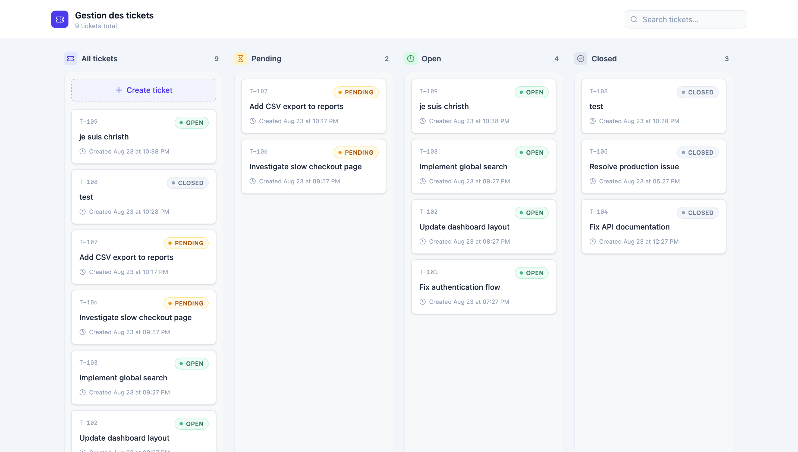

# Gestion des tickets — Exercice technique Full-Stack TypeScript
## Aperçu



Application de gestion de tickets présentée sous forme de Kanban à 4 colonnes
(**Tous les tickets / En attente / Ouverts / Fermés**), avec un frontend
React + TypeScript et une API REST Node.js + Express + TypeScript. Stockage
en mémoire, sans base de données.

Cycle de vie d'un ticket :

```
créé → pending → (clic "Ouvrir le ticket") → open → (clic "Fermer le ticket") → closed
                                    ↑                                              │
                                    └──────── (Réouvrir + confirmation) ───────────┘
```

- `pending` : état initial à la création, `openedAt` est `null`, le timer
  n'a pas démarré.
- `open` : `openedAt` est fixé au moment du clic sur "Ouvrir le ticket"
  (depuis pending) ou "Réouvrir" (depuis closed) — le timer démarre/redémarre
  à cet instant précis.
- `closed` : `closedAt` est enregistré au moment de la fermeture.

## Stack

**Frontend**
- React 19 + TypeScript
- Vite (bundler/dev server)
- TanStack Query (cache, requêtes, mutations)
- Tailwind CSS (styling)
- lucide-react (icônes)
- Vitest + React Testing Library (tests)

**Backend**
- Node.js + Express + TypeScript
- Stockage en mémoire (tableau, réinitialisé au redémarrage du serveur)
- Jest + supertest (tests bonus)

## Installation

Deux applications séparées, à lancer dans deux terminaux.

```bash
# Terminal 1 — backend (http://localhost:4000)
cd backend
npm install
npm run dev

# Terminal 2 — frontend (http://localhost:5173)
cd frontend
npm install
npm run dev
```

Le frontend proxifie `/api/*` vers `http://localhost:4000` (voir
`frontend/vite.config.ts`), il n'y a donc rien à configurer côté CORS en dev.

Pour lancer les tests :

```bash
cd backend && npm test
cd frontend && npm test
```

## Architecture

### Backend

```
backend/src/
  types/          → Ticket, TicketStatus, DTOs (contrat de données)
  store/          → ticketStore.ts : collection en mémoire, CRUD brut
  services/       → ticketService.ts : règles métier + validation
  controllers/    → traduisent HTTP <-> service
  routes/         → déclaration des endpoints Express
  middleware/      → gestion d'erreur centralisée (400/404/500)
  app.ts          → assemblage express (middlewares, routes)
  server.ts       → point d'entrée (écoute le port)
```

Flux : `Route → Controller → Service → Store`. Le controller ne connaît pas
les règles métier (ex: "un titre vide est invalide") : c'est le rôle du
service, qui lève des erreurs typées (`ValidationError`, `NotFoundError`)
attrapées par le middleware d'erreur centralisé plutôt que par des
try/catch dupliqués dans chaque route.

### Frontend

```
frontend/src/
  types/ticket.ts         → miroir des types backend
  services/ticketService.ts → seul point d'accès à l'API (fetch centralisé)
  hooks/useTickets.ts     → TanStack Query : cache, requêtes, mutations optimistes
  hooks/queryKeys.ts      → factory de clés de cache (`all`, `detail(id)`)
  components/
    TicketCard/           → carte d'un ticket
    TicketColumn/         → colonne générique (titre, compteur, empty state)
    TicketForm/            → modal de création
    TicketDetails/          → panneau latéral (détails + actions + timer)
    ConfirmDialog/          → confirmation de réouverture
    TicketBoard/            → composant racine, assemble tout + états globaux
  App.tsx
```

Aucun composant ne fait de `fetch` directement : tout passe par
`ticketService`. Aucun composant n'a de logique métier propre : `useTickets`
est la seule source de vérité sur l'état des tickets, ce qui évite les
divergences entre colonnes après une création/fermeture/réouverture.

## Modèle de données

```ts
type TicketStatus = "pending" | "open" | "closed";

interface Ticket {
  id: string;
  title: string;
  status: TicketStatus;
  createdAt: string;   // ISO — date de création
  openedAt: string | null;  // début du traitement (fixé/mis à jour à l'ouverture ou la réouverture)
  closedAt: string | null;  // date de fermeture
}
```

Le backend génère systématiquement `id`, `status` initial (`pending`) et
les dates ; le client n'envoie jamais ces champs. `pending` n'est jamais une
cible acceptée par `PATCH /api/tickets/:id/status` : c'est uniquement
l'état initial attribué à la création, il n'existe pas de bouton pour y
revenir.

## API

| Méthode | Route                     | Description                          | Codes                |
|---------|---------------------------|---------------------------------------|-----------------------|
| GET     | `/api/tickets`             | Liste tous les tickets                | 200                    |
| POST    | `/api/tickets`             | Crée un ticket (`{ title }`)          | 201, 400               |
| PATCH   | `/api/tickets/:id/status`  | Change le statut (`{ status }`)       | 200, 400, 404          |

Erreur inattendue → 500 (`{ error: "Internal server error." }`).

## Fonctionnalités

### Obligatoires
- Consultation des tickets (GET) et répartition automatique En attente / Ouverts / Fermés
- Création de ticket avec validation (titre requis, non vide) frontend + backend
- Un nouveau ticket démarre en `pending`, sans `openedAt`
- États loading / error (avec retry) / empty, bien distincts
- État "creating" avec bouton désactivé pendant la création
- Kanban 4 colonnes : Tous les tickets (+ bouton créer) / En attente / Ouverts / Fermés
- Ouverture d'un ticket pending (démarre le traitement et le timer)
- Fermeture d'un ticket ouvert
- Réouverture d'un ticket fermé avec confirmation préalable
- Gestion d'erreur de mise à jour de statut (le ticket garde son statut
  précédent en cas d'échec, nouvelle tentative possible)

## Améliorations possibles dans un vrai environnement
- Base de données (persistance réelle, transactions)
- Authentification / autorisations par utilisateur
- Pagination et tri côté serveur
- Historique des changements de statut (audit trail)
- Notifications temps réel (WebSocket) lors des changements
- Tests end-to-end

## Utilisation de l'IA

Outils utilisés :
- Cursor

Utilisation :
- vérification structure de fichiers/exports
- Erreur ts-node-dev : fichier src/server.ts introuvable → chemin relatif avec ./
- Conflit majeur TypeScript 7 vs ts-jest : ts-jest exige typescript < 7. Tu as choisi de garder TS 7 et de remplacer ts-jest par @swc/jest + @swc/core, avec un script séparé typecheck (tsc --noEmit) pour garder la vérification de types
- Ajout de @types/jest + "jest" dans tsconfig.json pour que describe/it/expect soient reconnus
- Erreur TS2345 sur req.params.id / req.body?.status dans ticketController.ts → correction avec typeof narrowing + retours 400 explicites
- Erreur TS7030 (not all code paths return) → ajout des return manquants
- Migration Tailwind v3 → v4 (npx tailwindcss init -p obsolète, passage à @tailwindcss/postcss puis discussion du plugin Vite)
- FormEvent déprécié → FormEvent<HTMLFormElement>
- Règle ESLint react-refresh/only-export-components → extraction de StatusPill et formatDateTime dans des fichiers séparés
- Mise à jour des imports cassés dans TicketDetails.tsx suite à cette extraction
- Migration de `useTickets` vers TanStack Query (cache, mutations optimistes)
- Aide à la rédaction de cette documentation.

## Gestion des données côté frontend — TanStack Query

Le hook `useTickets` s'appuie sur **TanStack Query** plutôt que sur un
`useState`/`useEffect` fait maison, pour les raisons suivantes :

- **Cache et fraîcheur des données** : les tickets sont mis en cache par clé
  de requête (`["tickets"]`), avec une `staleTime` configurable. Un `refetch`
  manuel ou automatique (au retour sur l'onglet, à la reconnexion réseau)
  reste possible sans code supplémentaire.
- **États dérivés automatiquement** : `isLoading`, `isPending`, `error` sont
  fournis nativement par la librairie, éliminant le besoin de `useState`
  manuels pour chaque flag (`loading`, `creating`, `updatingId`, etc.).
- **Mutations optimistes** : `onMutate` met à jour le cache *avant* la
  réponse HTTP (ticket temporaire à la création, nouveau statut tout de
  suite). Le snapshot `previousTickets` est restauré dans `onError` en cas
  d'échec. `onSuccess` remplace ensuite le placeholder par la ressource
  serveur, sans refetch de toute la liste.
- **Moins de code, moins de bugs potentiels** : la logique de
  loading/error/retry qui était écrite à la main (et dupliquée entre
  `createTicket` et `updateStatus`) est désormais gérée par une librairie
  testée et largement utilisée en production.
- **Proche de RTK Query** : les concepts (queries, mutations, cache,
  invalidation) sont directement transposables à RTK Query, ce qui facilite
  la transition si le projet migre vers cette stack.

Un délai artificiel de 1200ms avait été temporairement ajouté pendant le
développement pour visualiser l'état de chargement (skeleton) ; il a été
retiré une fois cette validation faite, car il n'apportait aucune valeur en
dehors du développement local.